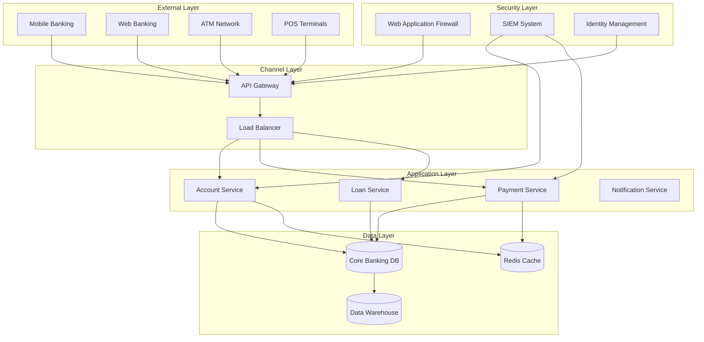

# Практична робота №1: Аналіз архітектури банківської системи

## 📋 Загальна інформація

- **Модуль:** 1 - Основи банківських ІТ-систем
- **Тема:** Аналіз архітектури реальної банківської системи з фокусом на безпеку
- **Тривалість:** 160 хвилин (4 академічні години)
- **Рівень складності:** Середній
- **Спеціальність:** Кібербезпека, 3 курс

---

## 🎯 Мета роботи

1. **Дослідити** архітектуру сучасної банківської системи на прикладі українського банку
2. **Ідентифікувати** ключові компоненти та їх взаємозв'язки
3. **Проаналізувати** механізми забезпечення безпеки на різних рівнях архітектури
4. **Виявити** потенційні вразливості та запропонувати покращення
5. **Документувати** результати дослідження згідно з best practices

---

## 📚 Теоретична база

### Основні архітектурні патерни банківських систем

#### 1. **Монолітна архітектура**
```
┌─────────────────────────────────┐
│     Core Banking System         │
│  ┌───────────────────────────┐  │
│  │    Database Layer         │  │
│  ├───────────────────────────┤  │
│  │    Business Logic         │  │
│  ├───────────────────────────┤  │
│  │    Presentation Layer     │  │
│  └───────────────────────────┘  │
└─────────────────────────────────┘
```

#### 2. **Мікросервісна архітектура**
```
┌─────────┐ ┌─────────┐ ┌─────────┐
│Account  │ │Payment  │ │Security │
│Service  │ │Service  │ │Service  │
└────┬────┘ └────┬────┘ └────┬────┘
     │           │           │
     └───────────┼───────────┘
                 │
            ┌────▼────┐
            │   API   │
            │ Gateway │
            └─────────┘
```

#### 3. **Гібридна архітектура** (найпоширеніша в українських банках)
- Core Banking - монолітна система
- Digital Banking - мікросервіси
- Mobile/Web - cloud-native компоненти

### Ключові компоненти банківської системи

| Компонент | Функція | Технології | Безпека |
|-----------|---------|------------|---------|
| **Core Banking System (CBS)** | Управління рахунками, транзакції | IBM DB2, Oracle | TDE, RBAC |
| **Payment Gateway** | Обробка платежів | Java, .NET | PCI DSS, SSL/TLS |
| **Digital Channels** | Web/Mobile banking | React, Swift | OAuth 2.0, Biometrics |
| **Data Warehouse** | Аналітика, звітність | Hadoop, Spark | Encryption at rest |
| **Integration Layer** | ESB, API management | MuleSoft, WSO2 | API keys, Rate limiting |
| **Security Layer** | Автентифікація, моніторинг | SIEM, WAF | Multi-factor auth |

---

## 🔬 Хід роботи

### Частина 1: Вибір об'єкта дослідження (20 хв)

#### Завдання 1.1: Обрати український банк для аналізу

**Рекомендовані варіанти:**
- [ ] ПриватБанк (найбільший, технологічно розвинений)
- [ ] Monobank (повністю digital, cloud-native)
- [ ] Ощадбанк (державний, legacy системи)
- [ ] ПУМБ (гібридна архітектура)
- [ ] А-Банк (інноваційні рішення)

**Критерії вибору:**
1. Доступність публічної інформації
2. Технологічна зрілість
3. Розмір та складність системи
4. Наявність кейсів кібербезпеки

#### Завдання 1.2: Збір публічної інформації

**Джерела даних:**
- Офіційні сайти та документація API
- Технічні блоги та презентації (DOU, Habr)
- Вакансії (технологічний стек)
- Новини про кіберінциденти
- Регуляторні звіти НБУ

**Шаблон збору інформації:**
```markdown
## Банк: [Назва]

### Загальна інформація
- Кількість клієнтів: 
- Кількість транзакцій/день:
- Наявність цифрових каналів:

### Технологічний стек
- Core Banking:
- Бази даних:
- Мови програмування:
- Хмарні сервіси:

### Безпека
- Сертифікації:
- Інциденти (якщо відомі):
- Публічні заходи безпеки:
```

---

### Частина 2: Моделювання архітектури (40 хв)

#### Завдання 2.1: Створення високорівневої діаграми

Використовуючи draw.io або Mermaid, створіть діаграму архітектури.

**Приклад Mermaid діаграми:**


#### Завдання 2.2: Деталізація компонентів

Для кожного ключового компонента створіть опис:

**Шаблон опису компонента:**
```markdown
### Компонент: [Назва]

**Призначення:** 
[Опис функціональності]

**Технології:**
- Платформа:
- Мова програмування:
- Фреймворки:
- Протоколи:

**Взаємодія:**
- Вхідні з'єднання:
- Вихідні з'єднання:
- API endpoints:

**Безпека:**
- Автентифікація:
- Авторизація:
- Шифрування:
- Логування:

**Метрики:**
- Пропускна здатність:
- Latency:
- Availability:
```

---

### Частина 3: Аналіз безпеки (60 хв)

#### Завдання 3.1: Threat Modeling

Використовуючи методологію **STRIDE**, проаналізуйте загрози:

| Категорія | Загроза | Компонент | Ймовірність | Вплив | Мітигація |
|-----------|---------|-----------|-------------|-------|-----------|
| **S**poofing | Підробка ідентифікації | API Gateway | Середня | Високий | MFA, сертифікати |
| **T**ampering | Зміна даних транзакцій | Payment Service | Низька | Критичний | HMAC, цифровий підпис |
| **R**epudiation | Відмова від транзакції | Core Banking | Низька | Високий | Audit logs, blockchain |
| **I**nformation Disclosure | Витік даних клієнтів | Database | Середня | Критичний | TDE, access control |
| **D**enial of Service | DDoS атака | Web Banking | Висока | Високий | CDN, rate limiting |
| **E**levation of Privilege | Підвищення прав | IAM System | Низька | Критичний | RBAC, zero trust |

#### Завдання 3.2: Аналіз захисних механізмів

**Рівні захисту:**

1. **Network Security**
    - [ ] Firewalls (WAF, Network FW)
    - [ ] IDS/IPS системи
    - [ ] Network segmentation
    - [ ] VPN для внутрішніх з'єднань

2. **Application Security**
    - [ ] Input validation
    - [ ] SQL injection prevention
    - [ ] XSS protection
    - [ ] CSRF tokens
    - [ ] Security headers

3. **Data Security**
    - [ ] Encryption at rest (TDE)
    - [ ] Encryption in transit (TLS 1.3)
    - [ ] Tokenization (PAN, CVV)
    - [ ] Data masking
    - [ ] Key management (HSM)

4. **Identity & Access**
    - [ ] Multi-factor authentication
    - [ ] Biometric authentication
    - [ ] Role-based access control
    - [ ] Privileged access management
    - [ ] Session management

5. **Monitoring & Response**
    - [ ] SIEM integration
    - [ ] Real-time fraud detection
    - [ ] Anomaly detection (ML)
    - [ ] Incident response plan
    - [ ] Forensics capabilities

#### Завдання 3.3: Compliance матриця

| Стандарт/Регуляція | Вимога | Реалізація | Статус |
|-------------------|--------|------------|---------|
| **PCI DSS** | Захист карткових даних | TDE, tokenization | ✅ |
| **GDPR** | Захист персональних даних | Encryption, consent management | ✅ |
| **НБУ №95** | Управління ІТ-ризиками | Risk assessment, BCP | ⚠️ |
| **ISO 27001** | ISMS | Політики безпеки, аудит | ✅ |
| **SWIFT CSP** | Безпека SWIFT | Segregation, monitoring | ✅ |

---

### Частина 4: Виявлення вразливостей (40 хв)

#### Завдання 4.1: Аналіз OWASP Top 10 для банківських систем

| # | Вразливість | Присутня? | Локація | Критичність | Рекомендації |
|---|-------------|-----------|---------|-------------|--------------|
| 1 | Injection | ❓ | API, CBS | Critical | Prepared statements, WAF |
| 2 | Broken Authentication | ❓ | Mobile app | High | MFA, session timeout |
| 3 | Sensitive Data Exposure | ❓ | Logs, API | Critical | Encryption, masking |
| 4 | XML External Entities | ❓ | SOAP services | Medium | Disable XXE |
| 5 | Broken Access Control | ❓ | Admin panel | High | RBAC, least privilege |
| 6 | Security Misconfiguration | ❓ | Servers | Medium | Hardening, patches |
| 7 | Cross-Site Scripting | ❓ | Web banking | Medium | CSP, sanitization |
| 8 | Insecure Deserialization | ❓ | API | High | Input validation |
| 9 | Components with Vulnerabilities | ❓ | Libraries | High | Dependency scanning |
| 10 | Insufficient Logging | ❓ | All systems | Medium | Centralized logging |

#### Завдання 4.2: Специфічні банківські вразливості

**Додаткові вектори атак:**

1. **Transaction Manipulation**
    - Race conditions
    - Double spending
    - Balance manipulation

2. **API Abuse**
    - Rate limiting bypass
    - Parameter pollution
    - JWT vulnerabilities

3. **Mobile Banking**
    - Reverse engineering
    - Certificate pinning bypass
    - Biometric spoofing

4. **Social Engineering**
    - Phishing campaigns
    - Vishing attacks
    - SIM swapping

5. **Insider Threats**
    - Privilege abuse
    - Data exfiltration
    - Unauthorized access

---

## 📊 Результати та рекомендації

### Шаблон звіту

```markdown
# Звіт з аналізу архітектури [Назва банку]

## Executive Summary
[Короткий опис основних знахідок - 3-5 речень]

## 1. Архітектурний огляд
### 1.1 Загальна архітектура
[Опис та діаграма]

### 1.2 Ключові компоненти
[Таблиця компонентів]

### 1.3 Технологічний стек
[Список технологій]

## 2. Аналіз безпеки
### 2.1 Сильні сторони
- [Перелік позитивних аспектів]

### 2.2 Слабкі сторони
- [Перелік проблемних зон]

### 2.3 Загрози (Threats)
- [STRIDE аналіз]

### 2.4 Можливості покращення
- [Конкретні рекомендації]

## 3. Compliance статус
[Таблиця відповідності стандартам]

## 4. Рекомендації
### Критичні (негайне впровадження)
1. [Рекомендація з обґрунтуванням]

### Високий пріоритет (1-3 місяці)
1. [Рекомендація з обґрунтуванням]

### Середній пріоритет (3-6 місяців)
1. [Рекомендація з обґрунтуванням]

## 5. План покращення безпеки
[Roadmap з timeline]

## Додатки
- Додаток А: Детальні діаграми
- Додаток Б: Технічні специфікації
- Додаток В: Глосарій термінів
```

---

## 🎯 Критерії оцінювання

### Розподіл балів (100 балів total)

| Критерій | Бали | Опис |
|----------|------|------|
| **Повнота дослідження** | 20 | Охоплення всіх ключових компонентів |
| **Якість діаграм** | 15 | Точність, деталізація, читабельність |
| **Threat modeling** | 20 | Ідентифікація реальних загроз |
| **Аналіз безпеки** | 20 | Глибина аналізу механізмів захисту |
| **Рекомендації** | 15 | Практичність та обґрунтованість |
| **Оформлення звіту** | 10 | Структура, грамотність, візуалізація |

### Шкала оцінювання

- **90-100 балів (A)** - Відмінно: Комплексний аналіз з інноваційними рішеннями
- **75-89 балів (B)** - Добре: Якісний аналіз з незначними недоліками
- **60-74 бали (C)** - Задовільно: Базовий аналіз виконано правильно
- **<60 балів (D)** - Незадовільно: Суттєві прогалини в аналізі

---

## 💡 Додаткові завдання (бонусні бали)

### Завдання А: Порівняльний аналіз (+10 балів)
Порівняйте архітектуру обраного банку з міжнародним банком (JPMorgan Chase, HSBC, etc.)

### Завдання Б: Proof of Concept (+15 балів)
Створіть демо-версію одного з компонентів безпеки (наприклад, 2FA system)

### Завдання В: Incident Response Plan (+10 балів)
Розробіть детальний план реагування на кіберінцидент для обраного банку

---

## 📚 Рекомендована література

### Книги
1. "Bank 4.0" - Brett King
2. "The Architecture of Banking" - Daniel Gozman
3. "Cybersecurity in Finance" - Sylvain Bouyon

### Стандарти та Guidelines
1. [PCI DSS v4.0 Requirements](https://www.pcisecuritystandards.org/)
2. [OWASP Banking Security](https://owasp.org/www-project-mobile-security/)
3. [SWIFT Customer Security Programme](https://www.swift.com/myswift/customer-security-programme-csp)
4. [НБУ Постанова №95](https://bank.gov.ua/ua/legislation/Resolution_28062019_95)

### Технічні ресурси
1. [MITRE ATT&CK for Financial Services](https://attack.mitre.org/)
2. [NIST Cybersecurity Framework](https://www.nist.gov/cyberframework)
3. [ISO 27001 для банків](https://www.iso.org/isoiec-27001-information-security.html)

### Case Studies
1. Bangladesh Bank Heist (2016)
2. Carbanak APT Campaign (2013-2018)
3. Capital One Breach (2019)
4. ПриватБанк DDoS (2024)

---

## ⚠️ Важливі зауваження

### Етичні аспекти
- ❌ НЕ проводити реальне тестування на проникнення
- ❌ НЕ використовувати інсайдерську інформацію
- ❌ НЕ розголошувати виявлені вразливості публічно
- ✅ Використовувати тільки публічні джерела
- ✅ Дотримуватися принципів responsible disclosure

### Безпека документації
- Використовувати умовні назви для чутливих компонентів
- Не включати реальні IP-адреси або credentials
- Маркувати документ як "Навчальний матеріал"

---

## 🤝 Консультації

**Графік консультацій:**
- Понеділок: 14:00-16:00 (онлайн)
- Середа: 15:00-17:00 (ауд. 305)
- П'ятниця: 13:00-14:00 (за домовленістю)

**Контакти викладача:**
- Email: [викладач]@university.edu
- Teams: [посилання на команду]
- Telegram: @[username] (тільки в робочий час)

---

## ✅ Чек-лист здачі роботи

- [ ] Обрано банк для дослідження
- [ ] Створено архітектурну діаграму
- [ ] Проведено threat modeling (STRIDE)
- [ ] Проаналізовано механізми безпеки
- [ ] Виявлено потенційні вразливості
- [ ] Розроблено рекомендації
- [ ] Оформлено звіт згідно з шаблоном
- [ ] Додано список використаних джерел
- [ ] Перевірено на плагіат (<20%)
- [ ] Завантажено в систему до дедлайну

**Дедлайн здачі:** [Дата] 23:59

---

*Успіхів у виконанні практичної роботи! 🚀*

*При виникненні питань - звертайтесь на консультації.*